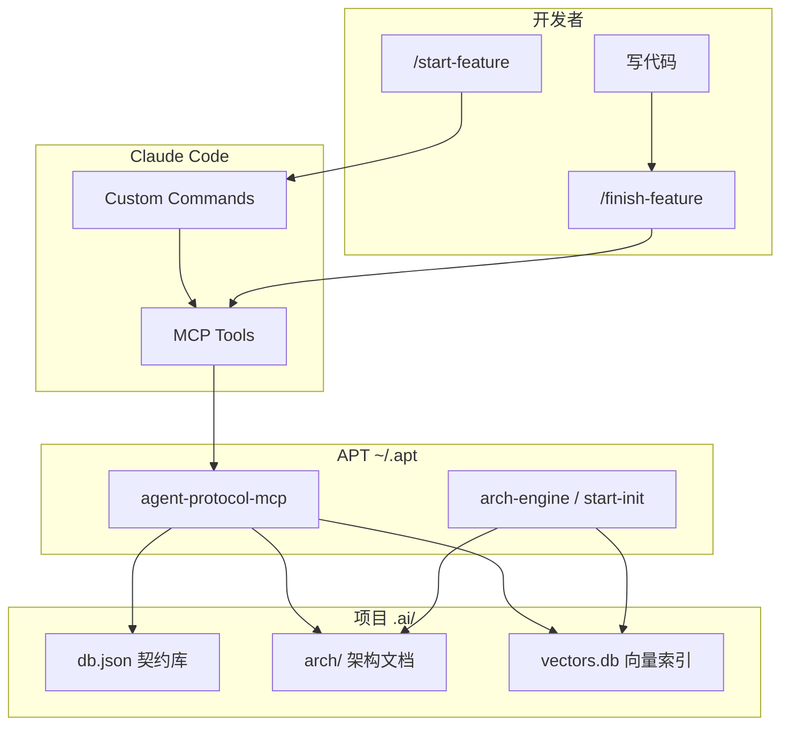

# Agent-Protocol-Toolkit (APT)

> 让 Claude Code 多代理开发「有规矩」——契约查询、架构检索、依赖阻塞，从 Prompt 软约束变成 MCP 硬约束。

**仓库：** [github.com/weilt/arch-engine](https://github.com/weilt/arch-engine)

**状态：** 试用中，欢迎 Star / Issue / PR。

---

## 这是什么？

APT（Agent-Protocol-Toolkit）是一套**全局安装、按项目激活**的开发工具集，面向 **Claude Code** 与 **MCP（Model Context Protocol）**。

大模型在长任务里常见问题：

- 忘记先查接口，直接「编造」类型
- 不读项目架构，重复造轮子
- 功能做完不登记契约，下一个代理继续猜

APT 用四层机制解决这些问题：

| 层级 | 作用 |
|------|------|
| **Custom Commands** | `/start-feature`、`/finish-feature` 引导固定流程 |
| **MCP Server** | `query_contract` / `register_contract` 等工具，代理必须调用 |
| **架构引擎** | `start-init` 扫描代码，生成可检索的架构文档 + 向量库 |
| **项目数据** | `.ai/db.json`、`.ai/arch/` 存契约与架构，随项目走 |

---

## 核心能力

### 契约管理（Contract）

- 开发前 **`query_contract`**：按名称查 TS 类型，找不到则必须 **`report_missing`** 并停止
- 完成后 **`register_contract`**：登记新接口，自动更新 `.ai/INDEX.md`

### 架构检索（Architecture）

- **`start-init`**：扫描 Java 模块、OpenAPI/Apifox、前端包，生成 Markdown + 向量索引
- **`search_arch`**：自然语言语义搜索（「用户登录接口在哪？」）
- **`query_arch`**：按 path 精读（如 `backend/auth/api#POST /login`）

### 跨平台

- macOS / Linux：`install.sh`、`agent-init.sh`
- Windows：`install.ps1`、`agent-init.ps1` / `.cmd`

---

## 工作原理



---

## 环境要求

- **Node.js 18+**
- **Claude Code**（已安装 CLI，支持 MCP）
- **架构扫描**需要 OpenAI 兼容的 Embedding / Chat API（见下方配置）
  - 已验证：阿里 DashScope、讯飞 MaaS 等兼容网关

---

## 安装（本机一次）

```bash
git clone https://github.com/weilt/arch-engine.git
cd arch-engine
```

在仓库根目录执行：

**macOS / Linux：**

```bash
chmod +x scripts/install.sh
./scripts/install.sh
```

**Windows（PowerShell）：**

```powershell
.\scripts\install.ps1
```

安装脚本会：

1. 构建并测试 `arch-engine`、`mcp-server`
2. 部署到 `~/.apt/`（Windows：`%USERPROFILE%\.apt\`）
3. 合并 MCP 配置到 `~/.claude/settings.json`
4. 将 `~/.apt/bin` 加入 PATH（含 `agent-init`、`start-init`）

安装完成后**重启终端**（Windows 建议重启 Claude Code）。

---

## 快速开始（每个项目）

在项目根目录：

```bash
# 1. 注入斜杠命令 + 初始化契约库
agent-init

# 2. 配置 API Key（见下一节），然后扫描架构
start-init

# 3. 重启 Claude Code，加载 MCP
```

Windows 可用 `agent-init.cmd`、`start-init.cmd`。

### `agent-init` 做什么？

- 复制 `/start-feature`、`/finish-feature` 到 `.claude/commands/`
- 创建 `.ai/db.json`（空契约库）

### `start-init` 做什么？

- 扫描当前仓库（Java、OpenAPI、前端等）
- 生成 `.ai/arch/` 下的 Markdown、`arch-index.json`、`vectors.db`
- 首次运行若无配置文件，会创建 `arch.config.json` 模板并退出，配好 Key 后重跑

成功示例：

```text
✅ start-init complete: 1446 APIs, 60 modules, 892 chunks
```

---

## API Key 配置

Embedding（向量化）与语义分片（Chunking）需要 API Key。**不必配置系统环境变量**，任选一种方式即可。

**优先级（从高到低）：**

1. `.ai/arch/arch.secrets.json` — **推荐**，换机只拷贝此文件
2. `.ai/arch/arch.config.json` 内的 `embedding.apiKey` / `chunking.apiKey`
3. 环境变量（由 `apiKeyEnv` 指定变量名）

### 推荐：`arch.secrets.json`

路径：`<项目>/.ai/arch/arch.secrets.json`

```json
{
  "embedding": { "apiKey": "sk-你的DashScope密钥" },
  "chunking": { "apiKey": "sk-你的分片模型密钥" }
}
```

> 请加入 `.gitignore`，勿提交到 Git。仓库内提供了 [`docs/examples/arch.secrets.example.json`](docs/examples/arch.secrets.example.json) 作参考。

### 主配置：`arch.config.json`

路径：`<项目>/.ai/arch/arch.config.json`

完整示例见 [`docs/examples/arch.config.example.json`](docs/examples/arch.config.example.json)。DashScope + 讯飞 MaaS 典型片段：

```json
{
  "embedding": {
    "baseUrl": "https://dashscope.aliyuncs.com/compatible-mode/v1",
    "apiKeyEnv": "DASHSCOPE_API_KEY",
    "model": "text-embedding-v3"
  },
  "chunking": {
    "baseUrl": "https://你的-maas-端点/v1",
    "apiKeyEnv": "XF_MAAS_API_KEY",
    "chatModel": "astron-code-latest",
    "maxChunkTokens": 8000,
    "strategy": "semantic-only"
  },
  "apiSpecGlobs": [
    "docs/**/*.json",
    "**/openapi.json",
    "**/swagger.json",
    "**/apifox/**/*.json"
  ],
  "scanners": { "java": true, "frontend": true }
}
```

说明：

- `baseUrl` 支持任意 **OpenAI 兼容** API
- DashScope Embedding 单次 batch 上限 10，工具会自动处理
- `start-init` 重跑会清空 `.ai/arch/` 生成物，但**保留** `arch.config.json` 与 `arch.secrets.json`

---

## MCP 工具一览

| 工具 | 何时用 | 行为 |
|------|--------|------|
| `search_arch` | 不确定模块/API 在哪 | 语义搜索，返回 path + 摘要 |
| `query_arch` | 已锁定 path | 返回完整 Markdown 片段 |
| `query_contract` | 开发前查依赖 | 返回 TS 类型；找不到则报错 |
| `report_missing` | 契约不存在 | 写入缺失记录，**阻塞当前任务** |
| `register_contract` | 功能完成 | 登记新契约，更新 INDEX |

### 参数摘要

**search_arch**

- `query`（必填）：自然语言或关键词
- `limit`（可选）：条数，默认 5
- `filter.kind`（可选）：`api` / `rpc` / `component` / `module`

**query_arch**

- `path`（可选）：如 `backend/user/api` 或带锚点 `backend/user/api#GET /users`

**query_contract**

- `name`：契约或组件名称

**register_contract**

- `name`、`description`、`tsFilePath`（项目内相对路径）

---

## 推荐开发流程

1. 输入 **`/start-feature`**，描述要做的功能
2. 代理应依次：
   - `search_arch` / `query_arch` 了解架构
   - 对每个依赖调用 `query_contract`
   - 找不到则 `report_missing` 并停止
3. 输出开发计划，等你确认后再写代码
4. 开发完成后输入 **`/finish-feature`**
5. 代理应对每个新接口调用 `register_contract`

---

## `start-init` 扫描范围

| 来源 | 内容 |
|------|------|
| Java 模块 | 包结构、Controller 注解、RPC 等 |
| OpenAPI / Swagger / Apifox JSON | REST API 定义（**优先于** Java 注解重复项） |
| 前端包 | `package.json`、目录结构概览 |

通过 `arch.config.json` 的 `apiSpecGlobs`、`scanners` 开关控制。

---

## 目录结构

**全局安装（`~/.apt/`）：**

```text
~/.apt/
├── arch-engine/dist/cli.js    # start-init 引擎
├── mcp-server/dist/index.js   # MCP 入口
├── templates/                 # 斜杠命令模板
└── bin/
    ├── agent-init.sh / .ps1 / .cmd
    └── start-init.sh / .ps1 / .cmd
```

**项目内（运行 agent-init + start-init 后）：**

```text
<project>/
├── .claude/commands/
│   ├── start-feature.md
│   └── finish-feature.md
└── .ai/
    ├── db.json              # 契约 + 缺失上报
    ├── INDEX.md             # 契约总览（自动生成）
    └── arch/
        ├── arch.config.json
        ├── arch.secrets.json   # 可选，建议 gitignore
        ├── arch-index.json     # 架构树索引
        ├── vectors.db          # 语义检索
        ├── INDEX.md
        ├── backend/<module>/...
        └── frontend/<pkg>/...
```

---

## 常见问题

### 首次 `start-init` 只创建了 config 就退出？

正常。编辑 `.ai/arch/arch.config.json` 或 `arch.secrets.json` 填入 API Key，再执行 `start-init`。

### MCP 工具列表里没有 `search_arch`？

重启 Claude Code；确认 `~/.claude/settings.json` 已包含 `agent-protocol-mcp` 指向 `~/.apt/mcp-server/dist/index.js`。

### `Missing API key for embedding`？

按上文配置 `arch.secrets.json` 或 `arch.config.json` 中的 `apiKey`。

### Embedding 400：batch size？

DashScope 限制 batch ≤ 10，已内置；其他网关可在 config 中加 `"batchSize": 32`。

### 语义分片 500 / empty chunks？

短文档会本地单 chunk，不调用 LLM；长文档失败会自动 fallback。可用 `start-init --verbose` 看详细日志。

### 契约 TS 文件路径怎么写？

`register_contract` 的 `tsFilePath` 为**相对项目根**的路径，如 `src/contracts/user.ts`。

---

## 本地开发与测试

```bash
cd arch-engine && npm ci && npm test && npm run build
cd ../mcp-server && npm ci && npm test && npm run build
```

或重新跑安装脚本，会执行完整构建 + 测试后再部署。

---

## 仓库结构

```text
arch-engine/               # GitHub 仓库名（含完整 APT 工具集）
├── arch-engine/           # 架构扫描、分片、Embedding、向量库
├── mcp-server/            # MCP Server（契约 + 架构查询）
├── templates/         # Claude 斜杠命令
├── bin/               # agent-init / start-init 入口
├── scripts/           # install.sh / install.ps1
└── docs/
    ├── examples/      # 配置示例
    └── superpowers/   # 设计规格与实现计划
```

---

## 路线图与已知限制

**当前版本（v1.0 试用）：**

- [x] 契约查询 / 注册 / 缺失阻塞
- [x] Java + OpenAPI + 前端架构扫描
- [x] 向量语义检索
- [x] 配置文件内 API Key（无需环境变量）
- [x] Windows / macOS 安装脚本

**计划中：**

- [ ] TS AST 级契约校验（当前仅校验文件存在）
- [ ] Cursor / 其他 MCP 客户端文档
- [ ] 更多语言扫描器（Go、Python 等）

---

## 许可证

MIT License — 见 [LICENSE](LICENSE)。

---

## 反馈

试用过程中如有问题或建议，欢迎在 [GitHub Issues](https://github.com/weilt/arch-engine/issues) 反馈。
