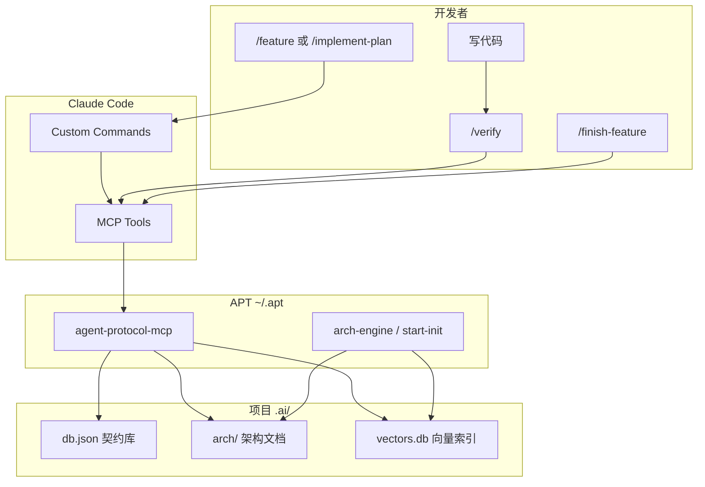

# Agent-Protocol-Toolkit (APT)

> 让 Claude Code 多代理开发「有规矩」——契约查询、架构检索、依赖阻塞，从 Prompt 软约束变成 MCP 硬约束。

**仓库：** [github.com/weilt/arch-engine](https://github.com/weilt/arch-engine)

**状态：** 试用中，欢迎 Star / Issue / PR。

### 宣讲材料

现场分享或对外介绍 APT，可直接使用：

| 文件 | 说明 |
|------|------|
| [apt-intro.pptx](docs/presentations/apt-intro/apt-intro.pptx) | 15 页宣讲幻灯片（PowerPoint） |
| [apt-intro.pdf](docs/presentations/apt-intro/apt-intro.pdf) | PDF 版（可异步分享） |
| [speaker-notes.md](docs/presentations/apt-intro/speaker-notes.md) | 现场口播备注（15–20 分钟） |

口播稿与 [source.md](docs/presentations/apt-intro/source.md) 已与 README 同步（2026-06-25，含 **ZCode** 五端与 MCP 配置说明）。**pptx/pdf 幻灯片图像仍为上一版**，重生成步骤见 [宣讲维护手册](docs/presentations/_template/README.md)。

维护者从 README 再生成：见 [docs/presentations/_template/README.md](docs/presentations/_template/README.md) 与 `templates/apt-deck.md`。

---

## 这是什么？

APT（Agent-Protocol-Toolkit）是一套**全局安装、按项目激活**的开发工具集，面向 **Claude Code**、**Cursor**、**Qoder**、**Codex**、**ZCode** 与 **MCP（Model Context Protocol）**。

大模型在长任务里常见问题：

- 忘记先查接口，直接「编造」类型
- 不读项目架构，重复造轮子
- 功能做完不登记契约，下一个代理继续猜

APT 用四层机制解决这些问题：

| 层级 | 作用 |
|------|------|
| **Custom Commands** | 10 个斜杠命令；有 brainstorming spec 时 **`/plan-from-spec` → `/implement-plan`**，否则 **`/feature`**（见下方工作流） |
| **MCP Server** | 契约 / 架构 / 设计共 **16** 个工具，代理必须调用 |
| **架构引擎** | `start-init` 扫描代码，生成可检索的架构文档 + 向量库 |
| **项目数据** | `.ai/db.json`、`.ai/arch/`、`.ai/design/` 存契约、架构与设计知识 |

---

## 命令与工具一览

运行 `agent-init` 后，在 Claude Code / Cursor / Qoder / ZCode 中可用斜杠命令，在 Codex / ZCode 中亦可用 `apt-*` Skills（`$apt-feature` 等）；终端 CLI 与 MCP 工具在全局安装后即可使用（MCP 需在项目根执行 `agent-init` 写入 `APT_PROJECT_ROOT`）。

### 斜杠命令（10）

| 命令 | 用途 |
|------|------|
| **`/plan-from-spec`** | **第三阶段推荐**：从 brainstorming spec 经 MCP 寻址生成双 Part 实现方案（不写代码） |
| **`/implement-plan`** | 按已批准 plan **编排子 Agent 串行实现**（每 Task 独立上下文）并自动闭环 |
| **`/feature`** | 无 spec 时一站式：寻址 → 计划 → **子 Agent 编排实现** → 闭环 |
| **`/verify`** | 实现后验收门禁：对照 plan、只读 arch/设计 audit（含 UI 时）、契约与可检索性检查、跑测试 |
| **`/finish-feature`** | `/verify` 未通过或闭环漏跑时的写侧补救 |
| **`/design-system`** | 立项定视觉：`design-sync` 沉淀到 `.ai/design/` |
| **`/design-page`** | 单页原型定稿：`design-sync --pages-only`，可选 `design-bindings --check` |
| **`/apt-goal`** | 自主闭环主入口：外层 loop 强制走全流程（brainstorm / spec / plan / implement / verify），主 Agent 仅编排 |
| **`/auto-brainstorm`** | APT 原生 brainstorming 引擎：9 步 + ontology 感知 + 风险分级，low 自动批、high 停等人批，终端接 /plan-from-spec |
| **`/current-status`** | 人读项目进度与建议下一步 |

> **迁移：** `/start-feature` 已移除。无 spec 请用 `/feature`；有 spec 请用 `/plan-from-spec` → `/implement-plan`。实现后请用 `/verify` 验收。

由 `agent-init` 从 `~/.apt/templates/*.md` 分发到各平台（不含 `_` 开头的内部片段）：

| 平台 | 路径 |
|------|------|
| Claude Code / Cursor | `.claude/commands/` |
| Qoder | `.qoder/commands/` |
| ZCode | `.zcode/commands/`（斜杠命令）、`.zcode/skills/apt-*/`（`$apt-*` Skill） |
| Codex | `.agents/skills/apt-*/SKILL.md` |

### 第三阶段工作流（有 brainstorming spec 时）

```text
brainstorming → docs/superpowers/specs/*-design.md
       ↓
/plan-from-spec <spec路径>  →  docs/apt/plans/*-plan.md（Part1 技术方案 + Part2 任务清单）
       ↓ 用户确认，Status → approved
/implement-plan <plan路径>  →  主 Agent 编排，每 Task 派子 Agent 串行 + 自动闭环
       ↓
/verify <plan路径>  →  验收门禁（FAIL → /finish-feature）
```

无 spec 时：`/feature` → `/verify` →（FAIL → `/finish-feature`）

**不用** superpowers `writing-plans`（不读 `.ai/` 索引）。规格见 [apt-plan-from-spec 设计](docs/superpowers/specs/2026-06-17-apt-plan-from-spec-design.md)。

### 自主闭环（APT 2.0）

完整产品目标可直接交给外层 loop 全自动跑完——主 Agent 仅编排，由 `loop` 反复驱动 brainstorm / spec / plan / implement / verify 直到闭环条件满足。

- **主入口 `/apt-goal <目标>`**：强制走完整 APT 流程（brainstorm → spec → plan → implement → verify），无需手动逐阶段触发。
- **`loopDone` 六项硬条件**（spec 5，全满足才结束）：① 目标存在 ② plan 全部 Task DONE ③ 最近一次 `/verify` PASS ④ `audit_arch_changes` 四类（modified / unregistered / new / deleted）全空 ⑤ 无审批阻塞 ⑥ UI 覆盖。
- **跨会话续跑**：`/loop until apt-status reports loopDone: /apt-goal --continue`，从中断处恢复。
- **机器可读状态**：`apt-status --json` 输出 `phase` / `loopDone` / `nextAction`，供 hook 与 loop 判断。
- **`.apt/` 提交策略**：`status.json`、`approvals.json`、`verify/latest.md`、`goal.md` 入 Git（团队与 CI 可读）；`.apt/orchestration/` 为本地账本，已 gitignore。

### 终端 CLI（5）

| 命令 | 用途 |
|------|------|
| **`agent-init`** | 项目初始化：多平台命令/Skills、`AGENTS.md`、`.ai/db.json`、MCP 配置（含 `.codex/config.toml`、`.zcode/mcp.json`） |
| **`start-init`** | 扫描代码生成 `.ai/arch/`（Markdown + 向量索引） |
| **`design-sync`** | 将设计真源同步到 `.ai/design/`（`--adapter baoyu`/`html`/`figma`/`v0`，`--incremental`） |
| **`design-bindings`** | 按 Vue/React 框架与 UI 库生成 `framework-bindings.json`（如 element-plus、antd） |
| **`sync-changes`** | 架构变更批量同步（等同 MCP `sync_arch_changes`） |

Windows 另有同名 `.cmd`（如 `agent-init.cmd`）。安装脚本会把 `~/.apt/bin` 加入 PATH。

### MCP 工具（16）

由 **`agent-protocol-mcp`**（`~/.apt/mcp-server/dist/index.js`）提供。

| 分类 | 工具 | 用途 |
|------|------|------|
| 契约 | `query_contract` | 按名称查 TS 类型 |
| 契约 | `register_contract` | 注册/更新契约 |
| 契约 | `report_missing` | 报告缺失契约并阻塞任务 |
| 架构 | `query_arch` | 按 path 精读架构文档 |
| 架构 | `search_arch` | 语义搜索架构 |
| 架构 | `register_asset` | 登记可复用架构资产 |
| 架构 | `refresh_asset` | 从源码重索引单个资产 |
| 架构 | `remove_asset` | 删除失效资产 |
| 架构 | `audit_arch_changes` | 审计相对上次扫描的变更 |
| 架构 | `sync_arch_changes` | 批量 audit → refresh → remove |
| 设计 | `query_design` | 查全局 token/样式、页面配方或语义组件 |
| 设计 | `search_ui` | 搜索 UI 组件与页面配方 |
| 设计 | `report_design_gap` | 报告设计缺口并阻塞臆造 UI |
| 设计 | `register_ui_pattern` | 登记页面实现与配方映射（闭环写侧） |
| 设计 | `audit_design_changes` | 只读审计设计知识漂移（stale、bindings、token 等） |
| 状态 | `query_project_status` | （只读）聚合 APT 自主闭环状态：`phase` / `loopDone` / `nextAction` |

---

## 核心能力

### 设计知识层（Design）— 框架无关

立项时用 **baoyu-design**（或其它设计工具）定风格，定稿后 **`design-sync`** 沉淀到 `.ai/design/`；选定技术栈后 **`design-bindings`** 写入框架映射。开发子 agent **先查设计、再查 arch**：

| 步骤 | CLI / MCP | 产出 |
|------|-----------|------|
| 定风格 | `design-sync` / `/design-system` | `.ai/design/` tokens、组件、页面配方 |
| 定框架 | `design-bindings` | `framework-bindings.json` + profile 偏好 |
| 开发寻址 | `query_design` / `search_ui` | 全局 tokens、bindings、页面/组件配方 |
| 缺定义 | `report_design_gap` | 阻塞臆造 UI |

- **`query_design`**：全局 tokens + `style.md` + bindings，或按 `page` / `component` 精读语义配方
- **`search_ui`**：关键词搜索语义组件与页面模板
- **`report_design_gap`**：缺设计定义时阻塞 UI 实现（对标 `report_missing`）
- **`/design-system`**：引导定风格 → `design-sync` → `design-bindings`
- **`/design-page`**：单页 baoyu 原型定稿 → `design-sync --pages-only`；**v0 多页**见下方[两阶段页面工厂](#两阶段页面工厂v0-多页)
- **`/feature` §0.5**：含 UI 的任务自动走设计寻址

本仓库自带参考夹具 **`designs/apt-reference-ds/`**（8 语义组件、2 页面配方），狗食测试见 `arch-engine/tests/dogfood/design-workflow.test.ts`。

```powershell
# baoyu 定稿后同步（默认 --adapter baoyu，读 designs/）
design-sync --source designs/my-app

# HTML 单页或 Figma 导出 ingest
design-sync --adapter html --source designs/pages/foo.html
design-sync --adapter figma --source designs/figma-export.json

# v0 页面 handoff（开发 apt-v0-handoff 写完双文件后）
design-sync --adapter v0 --source designs/v0/user-list
design-sync --adapter v0 --source designs/v0   # 批量扫描子目录

# Phase A 结束门禁（全部 approved 才允许 plan-from-spec 批量 UI）
node scripts/check-v0-freeze.mjs

# 增量同步（仅更新变更源文件；无 prior state 时回退全量）
design-sync --incremental

# 选定 Vue + Element Plus 后生成 bindings
design-bindings --framework vue --library element-plus

# 预览
design-sync --dry-run
```

### 两阶段页面工厂（v0 多页）

多页产品（PM 在 v0 出视觉稿）采用 **Phase A → Phase B**，避免批量 UI 在 logic 未冻结时开工。

```text
Phase A — 页面逻辑冻结（开发，逐页）
  输入：v0 成品（tsx/链接/截图）+ PM 设计文档（docs/）
  编排：Codex apt-v0-handoff（或 .agents/skills/apt-v0-handoff/）
  输出：designs/v0/<page-id>/{page.manifest.json, page.logic.md, page.tsx?}
  进度：designs/v0/_pages.md（开发维护 SSOT）
  结束：全部 approved + design-sync --adapter v0

Phase B — 批量开发
  输入：rollup spec（docs/superpowers/specs/*-pages-rollout-spec.md）
  编排：/plan-from-spec → 确认 → /implement-plan（串行）→ /verify
```

| 阶段 | 谁做 | 关键产物 |
|------|------|----------|
| **Phase A** | 开发 + `apt-v0-handoff` | 每页 manifest + logic、`approved`、`_pages.md` 全绿 |
| **Phase B** | plan/implement 子 Agent | 按 rollup spec 串行实现各页 UI + 业务 |

**Phase A 硬门禁：** 在项目根执行 `node scripts/check-v0-freeze.mjs`。脚本读取 `designs/v0/_pages.md`，要求每行 `approved = yes`，且对应目录含 `page.manifest.json` 与 `page.logic.md`。**exit 0（PASS）** 才允许撰写 rollup spec 并跑 `/plan-from-spec` 做全页 UI；**exit 1（FAIL）** 时须先完成 `apt-v0-handoff` 与单页 `design-sync`。

单页、无 rollup 时仍可用 `/feature`；Phase A 未完成时仅允许非 UI 或单页 handoff（见 `templates/feature.md`）。

### 契约管理（Contract）

- 开发前 **`query_contract`**：按名称查 TS 类型，找不到则必须 **`report_missing`** 并停止
- 完成后 **`register_contract`**：登记新接口，自动更新 `.ai/INDEX.md`

### 架构检索（Architecture）

- **`start-init`**：扫描 Java 模块、OpenAPI/Apifox、前端包，生成 Markdown + 向量索引（v2：AI 生成 AssetCard，写入 utils/enums/rpc 等资产文档）
- **Java REST 路径**：自动解析 `WebMvcRegistrations` → `WebProperties`（如芋道 `/admin-api`、`/app-api`、`/pc-api`），Controller 注解路径会拼上对应前缀后再入库
- **`search_arch`**：自然语言语义搜索（「用户登录接口在哪？」），结果含 `assetId`、`sourcePath` 便于跳转源码
- **`query_arch`**：按 path 精读（如 `backend/base-module-system-server/api#POST-/admin-api/system/auth/login`）
- **`register_asset`**：开发完成后登记可复用架构资产（工具类、枚举、组件等），立刻写入 `.ai/arch/` 并 upsert 向量库
- **`audit_arch_changes`**：对比上次 `start-init` 锚点，报告 `modified` / `unregistered` / `deleted` 资产（支持 git 与 nogit `fileHashes`）
- **`refresh_asset`**：从源码 AI summarize 后重索引单个资产（改代码后必须用此工具，不能用旧 summary 调 `register_asset` 代替）
- **`remove_asset`**：从 Markdown、arch-index 与向量库删除失效资产
- **`sync_arch_changes`**：批量 audit → refresh → remove（等同 `sync-changes` CLI）

### 开发后同步架构

功能开发完成后，架构向量与 Markdown 必须与源码一致。推荐流程：

| 方式 | 何时用 |
|------|--------|
| **`/feature`**（推荐） | 寻址 → 计划 → 实现 → **自动闭环**（含 audit/refresh/remove） |
| **`/verify`** | 实现后验收；对照 plan、只读 arch/设计 audit（含 UI 时）、测试（FAIL → `/finish-feature`） |
| **`/finish-feature`** | **补救**：verify 未通过或漏跑闭环时手动执行 |
| **`sync-changes`** | CLI 批量同步；`--dry-run` 仅报告，不写库 |
| **`start-init --incremental`** | 模块级全量重扫（变更面大时） |
| **`start-init --full`** | 清空 `.ai/arch` 后完整重建 |

**nogit 项目**（无 git 或不用 commit 锚点）：`start-init` 会写入 `last-scan.json` 的 `fileHashes`；`audit_arch_changes` 用文件 hash 检测变更。

```powershell
# 预览变更（不写库）
sync-changes --dry-run

# 在项目根批量修复
sync-changes
```


- macOS / Linux：`install.sh`、`agent-init.sh`
- Windows：`install.ps1`、`agent-init.ps1` / `.cmd`

---

## 工作原理

实现阶段（`/feature`、`/implement-plan`）：**主 Agent 只编排**，按 plan Part 2 或 §2.5 Task 列表 **严格串行**派发 implementer 子 Agent（每 Task 全新上下文）→ Task Review Gate → 每 Task `git commit` 与微闭环（`register_contract` / `refresh_asset` / `remove_asset`）→ 全部完成后主 Agent 执行 `audit_arch_changes` 最终 sweep。有 superpowers 时优先加载 `subagent-driven-development`。详见 [子 Agent 编排 spec](docs/superpowers/specs/2026-06-22-apt-subagent-orchestration-design.md)。



---

## 环境要求

- **Node.js 18+**
- **Claude Code**、**Cursor**、**Qoder**、**ZCode** 和/或 **Codex CLI**（均需支持 MCP）
- Claude Code 用户需安装 **Claude CLI**（`claude mcp` 注册全局 MCP）
- Qoder / Codex 用户需安装对应 CLI（`install.ps1` 会尝试 `qoder mcp add` / `codex mcp add`）；**ZCode 无全局 MCP CLI**，仅依赖项目级 `.zcode/mcp.json`
- **架构扫描**需要 OpenAI 兼容的 Embedding / Chat API（见下方配置）
  - 已验证：阿里 DashScope、讯飞 MaaS 等兼容网关

团队实践文档：[Claude Code 与 Cursor 最佳实践](docs/claude-code-best-practices.md)

---

## 安装（本机一次）

```bash
git clone https://github.com/weilt/arch-engine.git
cd arch-engine
```

在仓库根目录执行：

**macOS / Linux：**

```bash
chmod +x scripts/install.sh
./scripts/install.sh
```

**Windows（PowerShell）：**

```powershell
.\scripts\install.ps1
```

安装脚本会：

1. 构建并测试 `arch-engine`、`mcp-server`
2. 部署到 `~/.apt/`（Windows：`%USERPROFILE%\.apt\`）
3. 合并 MCP 配置到 Cursor `mcp.json` 与 Claude Code `~/.claude.json`（**不是** `settings.json`）
4. 将 `~/.apt/bin` 加入 PATH（含 `agent-init`、`start-init`、`design-sync`、`sync-changes`）

安装完成后**重启终端**，并**新开** Claude Code / Cursor 会话以加载 MCP。

### 升级 APT（仓库拉取新提交后）

在 APT 仓库根目录重新安装，同步 `~/.apt/templates/` 与 MCP 入口；再在**各业务项目根**执行 `agent-init` 刷新斜杠命令：

```powershell
cd F:\software\claude_plugin   # 你的 APT 克隆路径
git pull
.\scripts\install.ps1
cd E:\your-business-project
agent-init
```

仅重注册 MCP、不重建引擎时，可单独执行 `.\scripts\merge-mcp-config.ps1`。

---

## 快速开始（每个项目）

在项目根目录：

```bash
# 1. 注入斜杠命令 + 初始化契约库
agent-init

# 2. 配置 API Key（见下一节），然后扫描架构
start-init

# 3. 新开 IDE / Codex 会话，确认 agent-protocol-mcp 已连接（16 个 APT 工具）
```

Windows 可用 `agent-init.cmd`、`start-init.cmd`。

**Cursor：** 在业务项目根打开工作区；`agent-init` 会写入 `.cursor/mcp.json`（含 `APT_PROJECT_ROOT`）。若 MCP 列表出现两个 `agent-protocol-mcp`，只保留**项目级**那条（见 [故障排查](#cursor-里出现两个-agent-protocol-mcp)）。

**Qoder：** 项目级 MCP 复用 `.mcp.json`（与 Claude Code 相同）。在智能体模式确认 MCP 已连接；建议开启「后续 MCP 自动运行」（一次 `/feature` 可能连续调用多个工具）。

**Codex：** `agent-init` 写入 `.codex/config.toml`（gitignore，含本机路径）。会话内 `/mcp` 确认连接；使用 `apt-feature` 等 Skill 或 `/apt-feature`。

**ZCode：** `agent-init` 会写入 `.zcode/commands/`、`.zcode/skills/apt-*/` 以及参考用 `.zcode/mcp.json`（gitignore）。**斜杠命令与 `$apt-*` Skill 会自动生效**；**MCP 需在 ZCode UI 中单独配置**（ZCode 未必自动加载项目根 `.zcode/mcp.json`）。

1. 本机先 `install.ps1`，再在项目根 `agent-init`。
2. 用 ZCode **打开项目根目录** → **Settings → MCP Servers** → Scope 选 **Workspace**。
3. **Import**（从 Cursor `.cursor/mcp.json`、Claude Code 或 Codex 配置）**或**手动添加 `agent-protocol-mcp`：
   - Command：`node`
   - Args：`%USERPROFILE%\.apt\mcp-server\dist\index.js`（macOS/Linux：`~/.apt/mcp-server/dist/index.js`）
   - Env：`APT_PROJECT_ROOT` = 项目根绝对路径
4. 确认列表中 **16 个 APT 工具**已连接；使用 `/feature` 或 `$apt-feature`。

> **注意：** 若能看到 10 个 `/` 命令但 MCP 列表为空，属于「半套 APT」——命令可触发，但无法 `query_contract` / `search_arch` 硬约束寻址。ZCode 无 `zcode mcp add` CLI；`install` 不注册 ZCode 全局 MCP。

### `agent-init` 做什么？

- 从模板分发 10 个工作流命令：`.claude/commands/`、`.qoder/commands/`、`.zcode/commands/`、`.agents/skills/apt-*/`、`.zcode/skills/apt-*/`
- 幂等写入或更新 `AGENTS.md`（`<!-- apt-workflow -->` 路由片段）
- 创建 `.ai/db.json`（空契约库）
- 写入 `.mcp.json`、`.cursor/mcp.json`、`.codex/config.toml`、`.zcode/mcp.json`（后两者 gitignore），设置 `APT_PROJECT_ROOT`
- **ZCode 用户：** 命令/Skill 注入后即可用；MCP 仍以 ZCode **Settings → MCP Servers** 中是否出现 `agent-protocol-mcp` 为准（见上方 ZCode 快速开始）

### `start-init` 做什么？

- 扫描当前仓库（Java、OpenAPI、前端等）
- **Java API 路径解析**（在扫 Controller 之前）：发现 `WebMvcRegistrations` → 读取 `@ConfigurationProperties`（如 `WebProperties`）中的 `prefix` + 包名 Ant 规则；若 yml 有 `base.web.*` 覆盖则合并。日志会打印 `java path rules`（confidence、前缀列表）
- v2：Discovery → AI **AssetCard** 总结 → 按模块写入 `utils.md` / `enums.md` / `pojo.md` 等 → 向量化 **upsert** 到 `vectors.db`
- 生成 `.ai/arch/` 下的 Markdown、`arch-index.json`、`vectors.db`
- 首次运行若无配置文件，会创建 `arch.config.json` 模板并退出，配好 Key 后重跑

**增量扫描（v2）：** 成功跑完一次全量后，会在 `.ai/arch/last-scan.json` 记录 Git commit。之后默认 `start-init` 只处理相对上次 commit 的变更模块；需要重建全量索引时使用 `start-init --full`（首次无 `last-scan.json` 时等价于全量）。

**CLI 参数：** 推荐在项目根目录执行 `start-init`；也可指定路径，例如 `node ~/.apt/arch-engine/dist/cli.js E:\my-project --full`。加 `--verbose` 输出路径规则与分批总结日志。

成功示例：

```text
✅ start-init complete: 1446 APIs, 60 modules, 892 chunks
```

---

## API Key 配置

Embedding（向量化）与语义分片（Chunking）需要 API Key。**不必配置系统环境变量**，任选一种方式即可。

**优先级（从高到低）：**

1. `.ai/arch/arch.secrets.json` — **推荐**，换机只拷贝此文件
2. `.ai/arch/arch.config.json` 内的 `embedding.apiKey` / `chunking.apiKey`
3. 环境变量（由 `apiKeyEnv` 指定变量名）

### 推荐：`arch.secrets.json`

路径：`<项目>/.ai/arch/arch.secrets.json`

```json
{
  "embedding": { "apiKey": "sk-你的DashScope密钥" },
  "chunking": { "apiKey": "sk-你的分片模型密钥" }
}
```

> 请加入 `.gitignore`，勿提交到 Git。仓库内提供了 [`docs/examples/arch.secrets.example.json`](docs/examples/arch.secrets.example.json) 作参考。

### 主配置：`arch.config.json`

路径：`<项目>/.ai/arch/arch.config.json`

完整示例见 [`docs/examples/arch.config.example.json`](docs/examples/arch.config.example.json)。DashScope + 讯飞 MaaS 典型片段：

```json
{
  "embedding": {
    "baseUrl": "https://dashscope.aliyuncs.com/compatible-mode/v1",
    "apiKeyEnv": "DASHSCOPE_API_KEY",
    "model": "text-embedding-v3"
  },
  "chunking": {
    "baseUrl": "https://你的-maas-端点/v1",
    "apiKeyEnv": "XF_MAAS_API_KEY",
    "chatModel": "astron-code-latest",
    "maxChunkTokens": 8000,
    "strategy": "semantic-only"
  },
  "apiSpecGlobs": [
    "docs/**/*.json",
    "**/openapi.json",
    "**/swagger.json",
    "**/apifox/**/*.json"
  ],
  "scanners": { "java": true, "frontend": true }
}
```

说明：

- `baseUrl` 支持任意 **OpenAI 兼容** API
- DashScope Embedding 单次 batch 上限 10，工具会自动处理
- `start-init` 重跑会清空 `.ai/arch/` 生成物，但**保留** `arch.config.json` 与 `arch.secrets.json`
- 加载配置时会校验必填字段（`embedding.baseUrl`、`embedding.model`、`chunking.baseUrl`、`chunking.chatModel`），缺少时立即报错而非用默认值静默覆盖

---

## MCP 工具一览

完整列表见上文 **[命令与工具一览](#命令与工具一览)**。下表为常用工具速查；参数摘要见各工具说明。

| 工具 | 何时用 | 行为 |
|------|--------|------|
| `search_arch` | 不确定模块/API/工具类在哪 | 语义搜索，返回 path、摘要、`assetId`、`sourcePath` |
| `query_arch` | 已锁定 path | 返回完整 Markdown 片段 |
| `query_contract` | 开发前查 TS 依赖 | 返回 TS 类型；找不到则报错 |
| `register_contract` | 功能完成 / 对外 TS 类型 | **新增或更新**契约，自动刷新 `.ai/INDEX.md` |
| `register_asset` | 功能完成 / 可复用架构资产 | 写入 `.ai/arch/**` + 向量 upsert，供 `search_arch` 检索 |
| `refresh_asset` | 改源码后重索引单个资产 | AI summarize 后更新 Markdown 与向量 |
| `remove_asset` | 删除失效架构资产 | 从 Markdown、索引与向量库移除 |
| `audit_arch_changes` | 开发后检查架构漂移 | 对比上次 `start-init` 锚点，报告变更 |
| `sync_arch_changes` | 批量修复架构索引 | audit → refresh → remove（等同 `sync-changes` CLI） |
| `report_missing` | 契约或依赖不存在 | 写入缺失记录，**阻塞当前任务** |
| `query_design` | 含 UI 的开发前 | 全局 tokens + `style.md`，或按 page/component 查配方 |
| `search_ui` | 不确定用哪个语义组件 | 关键词搜索 `.ai/design/` 组件与页面 |
| `report_design_gap` | 缺设计定义 | 写入 `gaps.json`，**阻塞 UI 实现** |

### 参数摘要

**search_arch**

- `query`（必填）：自然语言或关键词
- `limit`（可选）：条数，默认 5
- `filter.kind`（可选）：`api` / `rpc` / `component` / `util` / `enum` / `starter` / `pojo` / `module`
- 每条命中含：`path`、`kind`、`summary`、`score`；架构资产另有 `assetId`、`sourcePath`

**register_asset**

- `kind`：`component` | `util` | `enum` | `starter` | `api` | `rpc` | `pojo`
- `name`、`module`（slug）、`sourcePath`（相对项目根）
- `summary`、`whenToUse`、`howToUse`
- 可选：`exports[]`、`related[]`、`tags[]`
- 返回：`{ ok: true, id, path }`（`path` 供 `query_arch` 使用）

**query_arch**

- `path`（可选）：如 `backend/base-module-system-server/api` 或带锚点 `backend/.../api#POST-/admin-api/system/auth/login`（锚点中的 `/` 在 id 里会写成 `-`）

**query_contract**

- `name`：契约或组件名称

**register_contract**

- `name`、`description`、`tsFilePath`（项目内相对路径）

---

## 推荐开发流程

**含 UI 的功能：** 先 `/design-system` 或 `design-sync` 确保 `.ai/design/` 就绪，再用 `/feature`。
> **完整产品目标**（从需求到验收一条龙、跨多阶段）请用 **`/apt-goal <目标>`**，由外层 loop 自动跑完全流程（见[自主闭环](#自主闭环apt-20)）；单功能开发仍用下方 `/feature` 流程。

1. 输入 **`/feature`**，描述要做的功能（命令内自动寻址设计 / 契约 / 架构）
2. 代理对每个依赖依次：`query_design`（若涉 UI）→ `query_contract` → 未命中则 `search_arch` + `query_arch` → 仍无则 `report_missing` 或 `report_design_gap` 并停止
3. 输出开发计划，等你确认后再写代码
4. **`/feature`** 会在实现后自动闭环；随后运行 **`/verify`** 验收；若 verify FAIL 或漏跑闭环，用 **`/finish-feature`** 补救
5. 代理应闭环：新 TS 契约 → `register_contract`；新组件/工具类/枚举/API 等 → `register_asset`；架构漂移 → `audit_arch_changes` / `sync_arch_changes`
6. 用 `search_arch` / `search_ui` 验证刚登记的内容可被检索命中（或由 `/verify` 集中执行）

---

## `start-init` 扫描范围

| 来源 | 内容 |
|------|------|
| Java 模块 | 包结构、Controller 注解、Feign RPC；**REST 路径会叠加 WebMvc 前缀**（见下节） |
| OpenAPI / Swagger / Apifox JSON | REST API 定义（**优先于** Java 注解：同 `method + path` 以 OpenAPI 为准） |
| 前端包 | `package.json`、目录结构、**组件 / Utils / 公用枚举**（含 JSDoc 说明与导出签名） |

通过 `arch.config.json` 的 `apiSpecGlobs`、`scanners` 开关控制。

### Java Controller URL 前缀（WebMvcRegistrations）

许多 Spring Boot 项目（含芋道 / ruoyi-vue-pro 系）**不在**每个 Controller 上写完整 URL，而是通过 `WebMvcRegistrations` 为不同包加前缀，例如：

| 前缀 | 典型包规则 |
|------|------------|
| `/admin-api` | `**.controller.admin.**` |
| `/app-api` | `**.controller.app.**` |
| `/pc-api` | `**.controller.pc.**` |

`start-init` 会按以下顺序解析（无需手工配置）：

1. 在仓库中查找实现或使用 `WebMvcRegistrations` 的配置类
2. 若引用 `WebProperties` 等 `@ConfigurationProperties`，读取其中 `new Api("/admin-api", "**.controller.admin.**")` 默认值
3. 若 `application*.yml` 存在 `base.web.admin-api.prefix` 等项，覆盖默认值
4. 扫描 Controller 时，根据 Java `package` 匹配 Ant 规则，将前缀拼到 `@RequestMapping` / `@GetMapping` 等路径上

示例：类上 `@RequestMapping("/system/auth")` + 方法 `@PostMapping("/login")`，包名为 `…controller.admin…` → 入库路径为 **`POST /admin-api/system/auth/login`**（与网关/Nginx 对外路径一致）。

#### 手动规则（`arch.config.json`）

当自动发现失败（独立 starter 不在工作区、规则仅在 Maven 依赖 JAR 内等），可在 `.ai/arch/arch.config.json` 声明 `java.controllerPathPrefixes`。**manual 规则始终覆盖**同 pattern 的自动发现结果：

```json
{
  "java": {
    "extraSourceRoots": ["../company-framework"],
    "controllerPathPrefixes": [
      {
        "prefix": "/admin-api",
        "controllerPattern": "**.controller.admin.**",
        "note": "管理端 Controller 统一前缀"
      },
      {
        "prefix": "/app-api",
        "controllerPattern": "**.controller.app.**"
      }
    ]
  }
}
```

| 字段 | 说明 |
|------|------|
| `controllerPathPrefixes[].prefix` | 以 `/` 开头，不含尾部 `/` |
| `controllerPathPrefixes[].controllerPattern` | Spring Ant 风格包名规则（`.` 为包分隔符） |
| `java.extraSourceRoots` | 可选；相对项目根的路径，仅用于 path-rules 发现（不自动加入 Maven 模块列表） |

修改手动规则后，执行 **`start-init --reindex-apis`**（可加 `--verbose`）仅重算 API 文档、arch-index 与 API 向量，**不会**重写 `utils.md` / `pojo.md` 等资产文档。增量 `start-init` 默认不重写 `api.md`；若 `path-rules.json` 相对上次扫描有变化，日志会 warn 建议 `--reindex-apis`。

```powershell
start-init --reindex-apis --verbose
# ✅ reindex-apis complete: 1446 APIs, 60 modules updated
```

#### 规则快照 `.ai/arch/path-rules.json`

每次解析或 `reindex-apis` 会写入合并后的规则快照（自动 + manual、`confidence`、`overrides` 等）。**建议提交 Git**（与 `arch-index.json` 同级，不含 secret），便于团队审计「当前生效的前缀从哪来」。

#### JAR 依赖兜底

APT **不**反编译或解析 `.m2` / `lib/*.jar` 内 class。若 `WebProperties` 等配置类只在依赖 JAR 中、工作区无框架源码：

1. 在 `arch.config.json` 配置 **`java.controllerPathPrefixes`**（见上）
2. 执行 **`start-init --reindex-apis`**
3. 或在 OpenAPI / Apifox JSON 中维护**完整 path**（OpenAPI 与 Java 合并时，同 `method + path` **以 OpenAPI 为准**）

说明：

- 若项目**没有** `WebMvcRegistrations` 且未配置 manual，行为与从前相同（仅注解路径）
- OpenAPI 与 Java 路径不一致时，**OpenAPI 条目保留**；Java 多出来的端点使用解析后的完整路径
- 使用 `start-init --verbose` 可在日志中看到 `java path rules` 解析结果

### 前端资产扫描说明

`start-init` 会扫描并写入以下内容，供 `search_arch` / `query_arch` 检索：

| 目录 | 记录内容 |
|------|----------|
| `src/components/**` | 组件名、文件路径、**JSDoc 说明**、**export 签名** |
| `src/utils/**` | 工具函数名、文件路径、**JSDoc 说明**、**export 签名** |
| `src/enums/**`、`src/constants/**` | 枚举名、成员列表、**JSDoc 说明** |

建议在组件、Utils、枚举上写 JSDoc 注释，扫描器会自动提取并写入 `.ai/arch/frontend/<pkg>/components.md`、`utils.md`、`enums.md`，同时进入向量索引。

### Starter 扫描说明（v2）

| 类型 | 识别规则 | 输出 |
|------|----------|------|
| Java `*-starter` Maven 模块 | 目录名或 `pom.xml` 的 `artifactId` 以 `-starter` 结尾 | `.ai/arch/backend/<module>/starter.md`（AutoConfiguration.imports、spring.factories、`@Configuration` 导出） |
| 前端 design-system / UI 基础包 | `arch.config.json` 的 `designSystemPackages` glob，或 `@scope/ui` / `@scope/*-ui` / slug 以 `-ui` 结尾且组件 ≥ 3 | `.ai/arch/frontend/<pkg>/starter.md`（package.json exports + 一级 `src/` 组件名） |

Starter 模块内的 `@Configuration` / `@AutoConfiguration` 不会重复写入 `utils.md`；包内组件仍单独写入 `components.md`。

示例：

```typescript
/** 表单提交主按钮，支持 loading / disabled 状态。 */
export function Button(props: ButtonProps) { ... }

/** 订单生命周期，checkout 与 admin 共用。 */
export enum OrderStatus { Pending, Paid, Shipped }
```

---

## 目录结构

**全局安装（`~/.apt/`）：**

```text
~/.apt/
├── arch-engine/dist/cli.js           # start-init 引擎
├── arch-engine/dist/cli-design-sync.js
├── arch-engine/dist/cli-sync.js      # sync-changes
├── mcp-server/dist/index.js          # MCP 入口
├── templates/                        # 斜杠命令模板
└── bin/
    ├── agent-init.sh / .ps1 / .cmd
    ├── start-init.sh / .ps1 / .cmd
    ├── design-sync.sh / .ps1 / .cmd
    └── sync-changes.sh / .ps1 / .cmd
```

**项目内（运行 agent-init + start-init 后）：**

```text
<project>/
├── .claude/commands/
│   ├── feature.md
│   ├── plan-from-spec.md
│   ├── implement-plan.md
│   ├── verify.md
│   ├── finish-feature.md
│   └── design-system.md
├── docs/apt/plans/          # /plan-from-spec 产出（双 Part 实现方案）
├── .mcp.json              # agent-init 生成（建议 gitignore）
├── .cursor/mcp.json         # 同上，含 APT_PROJECT_ROOT
└── .ai/
    ├── db.json              # 契约 + 缺失上报
    ├── INDEX.md             # 契约总览（自动生成）
    ├── design/              # design-sync 生成（profile、tokens、components）
    └── arch/
        ├── arch.config.json
        ├── arch.secrets.json   # 可选，建议 gitignore
        ├── arch-index.json     # 架构树索引
        ├── path-rules.json     # Java Controller 前缀合并快照（建议入 git）
        ├── last-scan.json      # v2 增量扫描锚点（git commit）
        ├── vectors.db          # 语义检索
        ├── INDEX.md
        ├── backend/<module>/...
        └── frontend/<pkg>/
            ├── components.md
            ├── utils.md
            └── enums.md
```

---

## 常见问题

### 首次 `start-init` 只创建了 config 就退出？

正常。编辑 `.ai/arch/arch.config.json` 或 `arch.secrets.json` 填入 API Key，再执行 `start-init`。

### MCP 工具列表里没有 `search_arch`？（Claude Code）

Claude Code **不会**读取 `~/.claude/settings.json` 里的 `mcpServers`（写了也静默忽略）。正确位置：

| 客户端 | MCP 配置文件 |
|--------|----------------|
| **Claude Code**（用户级） | `~/.claude.json` 顶层 `mcpServers` |
| **Claude Code**（项目级） | `~/.claude.json` → `projects["<路径>"].mcpServers`，或项目根 `.mcp.json` |
| **Cursor** | `~/.cursor/mcp.json` |

全局注册（install 已做，或手动）：

```powershell
claude mcp add agent-protocol-mcp -s user -- node $env:USERPROFILE\.apt\mcp-server\dist\index.js
claude mcp list   # 应显示 ✓ Connected
```

然后在**业务项目根**执行 `agent-init`，再在该目录打开 Claude Code。

然后**新开一个 Claude Code 会话**，运行 `/mcp` 确认工具列表含 `search_arch`、`query_contract` 等。

### Cursor 里 `/finish-feature` 提示「MCP contract registration is not available」？

说明当前会话未加载 APT MCP。安装后执行 `.\scripts\merge-mcp-config.ps1`（或 `install.ps1`），在 `%USERPROFILE%\.cursor\mcp.json` 中应出现 `agent-protocol-mcp`，**重启 Cursor**，并在 MCP 列表中确认有 `register_contract` / `register_asset` 等工具。

### ZCode 里能看到 `/` 命令，但 MCP 列表没有 `agent-protocol-mcp`？

常见情况：`.zcode/commands/` 已注入（10 个命令可见），但 MCP 未在 Settings 中配置。

1. 确认 `%USERPROFILE%\.apt\mcp-server\dist\index.js`（或 `~/.apt/...`）存在；若无，在 APT 仓库根执行 `.\scripts\install.ps1`。
2. 在项目根再执行 `agent-init`（生成参考用 `.zcode/mcp.json`）。
3. ZCode **Settings → MCP Servers** → Workspace → **Import**（从 Cursor/Claude/Codex）或 **Full configuration** 粘贴：

```json
{
  "mcpServers": {
    "agent-protocol-mcp": {
      "type": "stdio",
      "command": "node",
      "args": ["C:/Users/<you>/.apt/mcp-server/dist/index.js"],
      "env": { "APT_PROJECT_ROOT": "C:/path/to/your/project" }
    }
  }
}
```

4. 新开 ZCode 任务，确认 16 个工具可用。仅有命令无 MCP 时，代理无法执行契约/架构硬约束。

### Cursor 里出现两个 `agent-protocol-mcp`？

全局 `~/.cursor/mcp.json` 与项目 `.cursor/mcp.json` 各注册了一次，Cursor 会合并显示为两条。**在本项目开发时只保留项目级那条**（带 `APT_PROJECT_ROOT`）；可从全局配置删除 `agent-protocol-mcp` 避免重复。其他业务项目在项目根执行 `agent-init` 即可。

### MCP 是全局的还是按项目的？

| 步骤 | 作用 |
|------|------|
| **`install.ps1`** | 全局注册 MCP（Claude Code `user` 作用域 + Cursor `mcp.json`），**所有项目**可用 |
| **`agent-init`**（每个项目根） | 注入斜杠命令、初始化 `.ai/db.json`、写入项目根 `.mcp.json` 与 `.cursor/mcp.json`（含 `APT_PROJECT_ROOT`） |
| **`start-init`**（每个项目根） | 扫描架构生成 `.ai/arch/`（与 MCP 注册无关） |

在业务项目里开发时，用该项目文件夹作为工作区打开即可。`agent-init` 会在项目级 `.mcp.json` / `.cursor/mcp.json` 中写入 `APT_PROJECT_ROOT`，MCP 始终读取该项目的 `.ai/`。若使用全局 MCP 且未跑过 `agent-init`，可手动设 `APT_PROJECT_ROOT`（高级用法）。

### `Missing API key for embedding`？

按上文配置 `arch.secrets.json` 或 `arch.config.json` 中的 `apiKey`。

### Embedding 400：batch size？

DashScope 限制 batch ≤ 10，已内置；其他网关可在 config 中加 `"batchSize": 32`。

### 语义分片 500 / empty chunks？

短文档会本地单 chunk，不调用 LLM；长文档分片最多递归 5 层，超过则保留超大 chunk 并写入 warn 日志，不会卡住。可用 `start-init --verbose` 看详细日志。

### 契约 TS 文件路径怎么写？

`register_contract` 的 `tsFilePath` 为**相对项目根**的路径，如 `src/contracts/user.ts`。

### 重新注册已有契约会怎样？

`register_contract` 支持 **upsert**：同名契约已存在时自动更新（返回 `Contract updated`），不存在则新增（返回 `Contract registered`）。文件重构后直接重新调用即可，无需手动编辑 `.ai/db.json`。

### `register_asset` 与 `register_contract` 有什么区别？

- **契约**：面向 TS 类型文件，存 `.ai/db.json`，开发前 `query_contract`。
- **架构资产**：面向可复用的 Java/前端能力（Utils、Enum、Feign 等），存 `.ai/arch/` + `vectors.db`，开发前/后 `search_arch`。
- 同一功能若既有 TS 契约又有后端工具类，**两个都要注册**。

### 增量 `start-init` 不生效？

确认仓库是 Git 项目且存在 `.ai/arch/last-scan.json`；需要全量重建时执行 `start-init --full`。

### 改了 manual 规则要跑什么？

编辑 `.ai/arch/arch.config.json` 的 `java.controllerPathPrefixes` 后，执行 **`start-init --reindex-apis`**（不是增量 `start-init`）。该命令仅刷新各模块 `api.md`、`arch-index.json` 中 API 节点与 API 向量，并重写 `path-rules.json`；不会批量重写 `utils.md` 等资产。首次无 `.ai/arch/` 时须先 `start-init` 或 `--full`。

### 规则在依赖 JAR 里怎么办？

APT 不扫描 Maven 本地仓库或 `lib/*.jar` 内 class。若前缀配置只在依赖 JAR 中、工作区无框架源码：在 `arch.config.json` 配置 **`java.controllerPathPrefixes`**，再 **`start-init --reindex-apis`**；或在 OpenAPI / Apifox 中维护带完整前缀的 path（OpenAPI 优先于 Java 注解）。

### Java API 在 arch 里仍是 `/system/...` 没有 `/admin-api`？

说明扫描时未解析到 `WebMvcRegistrations` / `WebProperties`（或 Controller 不在 `controller.admin` 等包下）。用 `start-init --verbose` 查看 `java path rules` 是否含预期前缀；若 `confidence: low` 或规则缺失，在 `arch.config.json` 添加 manual 规则后执行 **`start-init --reindex-apis`**。全量重建索引用 `start-init --full`。

### chongqing / 大型项目全量扫描

仓库内提供 [`scripts/chongqing-full-scan.ps1`](scripts/chongqing-full-scan.ps1)：从 `.ai/arch/arch.secrets.json` 读取 Key，在项目根执行 `start-init --full`。修改 arch-engine 后可用本地构建的 CLI：

```powershell
$env:CHONGQING_ROOT = "E:\chongqing"
# 编辑脚本中的 $Cli 指向仓库 arch-engine\dist\cli.js，或先运行 scripts\install.ps1
powershell -File scripts\chongqing-full-scan.ps1
```

---

## 本地开发与测试

```bash
cd arch-engine && npm ci && npm test && npm run build
cd ../mcp-server && npm ci && npm test && npm run build
```

或重新跑安装脚本，会执行完整构建 + 测试后再部署。

---

## 仓库结构

```text
arch-engine/               # GitHub 仓库名（含完整 APT 工具集）
├── arch-engine/           # 架构扫描、分片、Embedding、向量库
├── mcp-server/            # MCP Server（契约 + 架构查询）
├── templates/         # Claude 斜杠命令
├── bin/               # agent-init / start-init / design-sync / sync-changes
├── scripts/           # install.sh / install.ps1
└── docs/
    ├── examples/      # 配置示例
    └── superpowers/   # 设计规格与实现计划
```

---

## 路线图与已知限制

**当前版本（v1.0 试用）：**

- [x] 契约查询 / 注册 / 缺失阻塞
- [x] `register_contract` 支持 upsert（同名自动更新）
- [x] Java + OpenAPI + 前端架构扫描
- [x] Java `WebMvcRegistrations` / `WebProperties` API 前缀解析（admin-api、app-api 等）
- [x] 前端组件 / Utils / 公用枚举（JSDoc + 导出签名）
- [x] 向量语义检索
- [x] 配置文件内 API Key（无需环境变量）
- [x] `arch.config.json` 启动时必填字段校验
- [x] Windows / macOS 安装脚本
- [x] 设计知识层（`.ai/design/`、`design-sync`、`register_ui_pattern`、`audit_design_changes` 等设计 MCP）
- [x] Spec → Plan → Implement（`/plan-from-spec`、`/implement-plan`，方案 C）

**计划中：**

- [ ] TS AST 级契约校验（当前仅校验文件存在）
- [ ] 更多语言扫描器（Go、Python 等）

---

## 许可证

MIT License — 见 [LICENSE](LICENSE)。

---

## 反馈

试用过程中如有问题或建议，欢迎在 [GitHub Issues](https://github.com/weilt/arch-engine/issues) 反馈。
