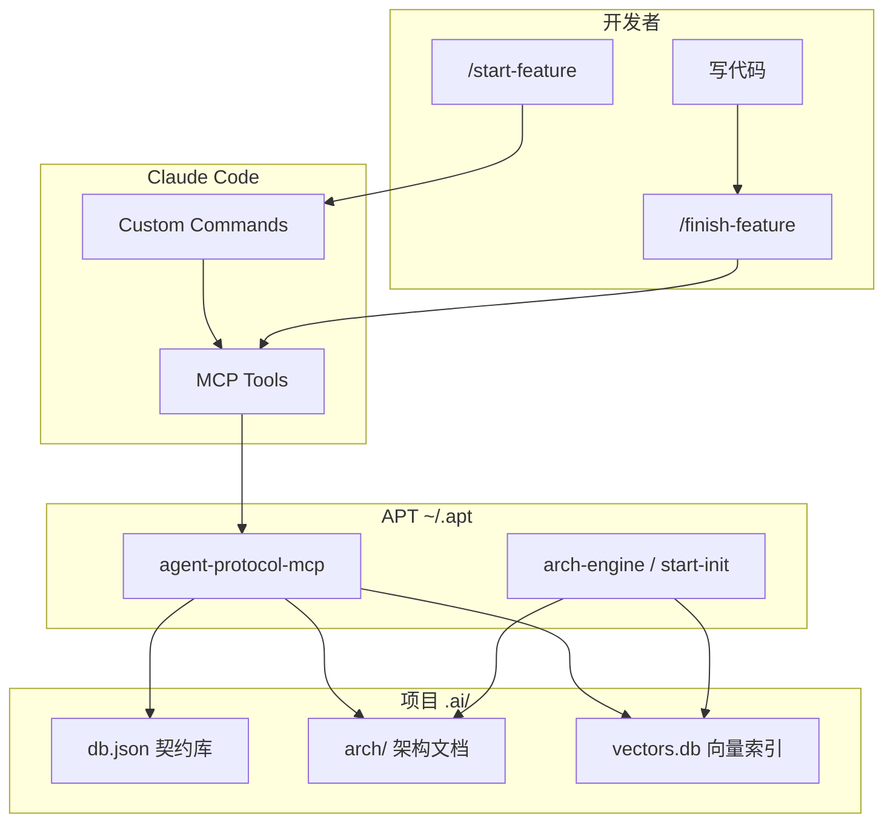

# Agent-Protocol-Toolkit (APT)

> 让 Claude Code 多代理开发「有规矩」——契约查询、架构检索、依赖阻塞，从 Prompt 软约束变成 MCP 硬约束。

**仓库：** [github.com/weilt/arch-engine](https://github.com/weilt/arch-engine)

**状态：** 试用中，欢迎 Star / Issue / PR。

---

## 这是什么？

APT（Agent-Protocol-Toolkit）是一套**全局安装、按项目激活**的开发工具集，面向 **Claude Code** 与 **MCP（Model Context Protocol）**。

大模型在长任务里常见问题：

- 忘记先查接口，直接「编造」类型
- 不读项目架构，重复造轮子
- 功能做完不登记契约，下一个代理继续猜

APT 用四层机制解决这些问题：

| 层级 | 作用 |
|------|------|
| **Custom Commands** | `/start-feature`、`/finish-feature` 引导固定流程 |
| **MCP Server** | `query_contract` / `register_contract` 等工具，代理必须调用 |
| **架构引擎** | `start-init` 扫描代码，生成可检索的架构文档 + 向量库 |
| **项目数据** | `.ai/db.json`、`.ai/arch/` 存契约与架构，随项目走 |

---

## 核心能力

### 契约管理（Contract）

- 开发前 **`query_contract`**：按名称查 TS 类型，找不到则必须 **`report_missing`** 并停止
- 完成后 **`register_contract`**：登记新接口，自动更新 `.ai/INDEX.md`

### 架构检索（Architecture）

- **`start-init`**：扫描 Java 模块、OpenAPI/Apifox、前端包，生成 Markdown + 向量索引（v2：AI 生成 AssetCard，写入 utils/enums/rpc 等资产文档）
- **Java REST 路径**：自动解析 `WebMvcRegistrations` → `WebProperties`（如芋道 `/admin-api`、`/app-api`、`/pc-api`），Controller 注解路径会拼上对应前缀后再入库
- **`search_arch`**：自然语言语义搜索（「用户登录接口在哪？」），结果含 `assetId`、`sourcePath` 便于跳转源码
- **`query_arch`**：按 path 精读（如 `backend/base-module-system-server/api#POST-/admin-api/system/auth/login`）
- **`register_asset`**：开发完成后登记可复用架构资产（工具类、枚举、组件等），立刻写入 `.ai/arch/` 并 upsert 向量库

### 跨平台

- macOS / Linux：`install.sh`、`agent-init.sh`
- Windows：`install.ps1`、`agent-init.ps1` / `.cmd`

---

## 工作原理



---

## 环境要求

- **Node.js 18+**
- **Claude Code**（已安装 CLI，支持 MCP）
- **架构扫描**需要 OpenAI 兼容的 Embedding / Chat API（见下方配置）
  - 已验证：阿里 DashScope、讯飞 MaaS 等兼容网关

---

## 安装（本机一次）

```bash
git clone https://github.com/weilt/arch-engine.git
cd arch-engine
```

在仓库根目录执行：

**macOS / Linux：**

```bash
chmod +x scripts/install.sh
./scripts/install.sh
```

**Windows（PowerShell）：**

```powershell
.\scripts\install.ps1
```

安装脚本会：

1. 构建并测试 `arch-engine`、`mcp-server`
2. 部署到 `~/.apt/`（Windows：`%USERPROFILE%\.apt\`）
3. 合并 MCP 配置到 Cursor `mcp.json` 与 Claude Code `~/.claude.json`（**不是** `settings.json`）
4. 将 `~/.apt/bin` 加入 PATH（含 `agent-init`、`start-init`）

安装完成后**重启终端**（Windows 建议重启 Claude Code）。

---

## 快速开始（每个项目）

在项目根目录：

```bash
# 1. 注入斜杠命令 + 初始化契约库
agent-init

# 2. 配置 API Key（见下一节），然后扫描架构
start-init

# 3. 重启 Claude Code，加载 MCP
```

Windows 可用 `agent-init.cmd`、`start-init.cmd`。

### `agent-init` 做什么？

- 复制 `/start-feature`、`/finish-feature` 到 `.claude/commands/`
- 创建 `.ai/db.json`（空契约库）

### `start-init` 做什么？

- 扫描当前仓库（Java、OpenAPI、前端等）
- **Java API 路径解析**（在扫 Controller 之前）：发现 `WebMvcRegistrations` → 读取 `@ConfigurationProperties`（如 `WebProperties`）中的 `prefix` + 包名 Ant 规则；若 yml 有 `base.web.*` 覆盖则合并。日志会打印 `java path rules`（confidence、前缀列表）
- v2：Discovery → AI **AssetCard** 总结 → 按模块写入 `utils.md` / `enums.md` / `pojo.md` 等 → 向量化 **upsert** 到 `vectors.db`
- 生成 `.ai/arch/` 下的 Markdown、`arch-index.json`、`vectors.db`
- 首次运行若无配置文件，会创建 `arch.config.json` 模板并退出，配好 Key 后重跑

**增量扫描（v2）：** 成功跑完一次全量后，会在 `.ai/arch/last-scan.json` 记录 Git commit。之后默认 `start-init` 只处理相对上次 commit 的变更模块；需要重建全量索引时使用 `start-init --full`（首次无 `last-scan.json` 时等价于全量）。

**CLI 参数：** 推荐在项目根目录执行 `start-init`；也可指定路径，例如 `node ~/.apt/arch-engine/dist/cli.js E:\my-project --full`。加 `--verbose` 输出路径规则与分批总结日志。

成功示例：

```text
✅ start-init complete: 1446 APIs, 60 modules, 892 chunks
```

---

## API Key 配置

Embedding（向量化）与语义分片（Chunking）需要 API Key。**不必配置系统环境变量**，任选一种方式即可。

**优先级（从高到低）：**

1. `.ai/arch/arch.secrets.json` — **推荐**，换机只拷贝此文件
2. `.ai/arch/arch.config.json` 内的 `embedding.apiKey` / `chunking.apiKey`
3. 环境变量（由 `apiKeyEnv` 指定变量名）

### 推荐：`arch.secrets.json`

路径：`<项目>/.ai/arch/arch.secrets.json`

```json
{
  "embedding": { "apiKey": "sk-你的DashScope密钥" },
  "chunking": { "apiKey": "sk-你的分片模型密钥" }
}
```

> 请加入 `.gitignore`，勿提交到 Git。仓库内提供了 [`docs/examples/arch.secrets.example.json`](docs/examples/arch.secrets.example.json) 作参考。

### 主配置：`arch.config.json`

路径：`<项目>/.ai/arch/arch.config.json`

完整示例见 [`docs/examples/arch.config.example.json`](docs/examples/arch.config.example.json)。DashScope + 讯飞 MaaS 典型片段：

```json
{
  "embedding": {
    "baseUrl": "https://dashscope.aliyuncs.com/compatible-mode/v1",
    "apiKeyEnv": "DASHSCOPE_API_KEY",
    "model": "text-embedding-v3"
  },
  "chunking": {
    "baseUrl": "https://你的-maas-端点/v1",
    "apiKeyEnv": "XF_MAAS_API_KEY",
    "chatModel": "astron-code-latest",
    "maxChunkTokens": 8000,
    "strategy": "semantic-only"
  },
  "apiSpecGlobs": [
    "docs/**/*.json",
    "**/openapi.json",
    "**/swagger.json",
    "**/apifox/**/*.json"
  ],
  "scanners": { "java": true, "frontend": true }
}
```

说明：

- `baseUrl` 支持任意 **OpenAI 兼容** API
- DashScope Embedding 单次 batch 上限 10，工具会自动处理
- `start-init` 重跑会清空 `.ai/arch/` 生成物，但**保留** `arch.config.json` 与 `arch.secrets.json`
- 加载配置时会校验必填字段（`embedding.baseUrl`、`embedding.model`、`chunking.baseUrl`、`chunking.chatModel`），缺少时立即报错而非用默认值静默覆盖

---

## MCP 工具一览

| 工具 | 何时用 | 行为 |
|------|--------|------|
| `search_arch` | 不确定模块/API/工具类在哪 | 语义搜索，返回 path、摘要、`assetId`、`sourcePath` |
| `query_arch` | 已锁定 path | 返回完整 Markdown 片段 |
| `query_contract` | 开发前查 TS 依赖 | 返回 TS 类型；找不到则报错 |
| `register_contract` | 功能完成 / 对外 TS 类型 | **新增或更新**契约，自动刷新 `.ai/INDEX.md` |
| `register_asset` | 功能完成 / 可复用架构资产 | 写入 `.ai/arch/**` + 向量 upsert，供 `search_arch` 检索 |
| `report_missing` | 契约不存在 | 写入缺失记录，**阻塞当前任务** |

### 参数摘要

**search_arch**

- `query`（必填）：自然语言或关键词
- `limit`（可选）：条数，默认 5
- `filter.kind`（可选）：`api` / `rpc` / `component` / `util` / `enum` / `starter` / `pojo` / `module`
- 每条命中含：`path`、`kind`、`summary`、`score`；架构资产另有 `assetId`、`sourcePath`

**register_asset**

- `kind`：`component` | `util` | `enum` | `starter` | `api` | `rpc` | `pojo`
- `name`、`module`（slug）、`sourcePath`（相对项目根）
- `summary`、`whenToUse`、`howToUse`
- 可选：`exports[]`、`related[]`、`tags[]`
- 返回：`{ ok: true, id, path }`（`path` 供 `query_arch` 使用）

**query_arch**

- `path`（可选）：如 `backend/base-module-system-server/api` 或带锚点 `backend/.../api#POST-/admin-api/system/auth/login`（锚点中的 `/` 在 id 里会写成 `-`）

**query_contract**

- `name`：契约或组件名称

**register_contract**

- `name`、`description`、`tsFilePath`（项目内相对路径）

---

## 推荐开发流程

1. 输入 **`/start-feature`**，描述要做的功能（无需关心契约 vs 架构，命令内自动寻址）
2. 代理对每个依赖依次：`query_contract` → 未命中则 `search_arch` + `query_arch` → 仍无则 `report_missing` 并停止
3. 输出开发计划，等你确认后再写代码
4. 开发完成后输入 **`/finish-feature`**
5. 代理应双轨闭环：新 TS 契约 → `register_contract`；新组件/工具类/枚举/API 等 → `register_asset`
6. 用 `search_arch` 验证刚登记的资产可被语义检索命中

---

## `start-init` 扫描范围

| 来源 | 内容 |
|------|------|
| Java 模块 | 包结构、Controller 注解、Feign RPC；**REST 路径会叠加 WebMvc 前缀**（见下节） |
| OpenAPI / Swagger / Apifox JSON | REST API 定义（**优先于** Java 注解：同 `method + path` 以 OpenAPI 为准） |
| 前端包 | `package.json`、目录结构、**组件 / Utils / 公用枚举**（含 JSDoc 说明与导出签名） |

通过 `arch.config.json` 的 `apiSpecGlobs`、`scanners` 开关控制。

### Java Controller URL 前缀（WebMvcRegistrations）

许多 Spring Boot 项目（含芋道 / ruoyi-vue-pro 系）**不在**每个 Controller 上写完整 URL，而是通过 `WebMvcRegistrations` 为不同包加前缀，例如：

| 前缀 | 典型包规则 |
|------|------------|
| `/admin-api` | `**.controller.admin.**` |
| `/app-api` | `**.controller.app.**` |
| `/pc-api` | `**.controller.pc.**` |

`start-init` 会按以下顺序解析（无需手工配置）：

1. 在仓库中查找实现或使用 `WebMvcRegistrations` 的配置类
2. 若引用 `WebProperties` 等 `@ConfigurationProperties`，读取其中 `new Api("/admin-api", "**.controller.admin.**")` 默认值
3. 若 `application*.yml` 存在 `base.web.admin-api.prefix` 等项，覆盖默认值
4. 扫描 Controller 时，根据 Java `package` 匹配 Ant 规则，将前缀拼到 `@RequestMapping` / `@GetMapping` 等路径上

示例：类上 `@RequestMapping("/system/auth")` + 方法 `@PostMapping("/login")`，包名为 `…controller.admin…` → 入库路径为 **`POST /admin-api/system/auth/login`**（与网关/Nginx 对外路径一致）。

说明：

- 若项目**没有** `WebMvcRegistrations`，行为与从前相同（仅注解路径）
- OpenAPI 与 Java 路径不一致时，**OpenAPI 条目保留**；Java 多出来的端点使用解析后的完整路径
- 使用 `start-init --verbose` 可在日志中看到 `start-init: java path rules` 解析结果

### 前端资产扫描说明

`start-init` 会扫描并写入以下内容，供 `search_arch` / `query_arch` 检索：

| 目录 | 记录内容 |
|------|----------|
| `src/components/**` | 组件名、文件路径、**JSDoc 说明**、**export 签名** |
| `src/utils/**` | 工具函数名、文件路径、**JSDoc 说明**、**export 签名** |
| `src/enums/**`、`src/constants/**` | 枚举名、成员列表、**JSDoc 说明** |

建议在组件、Utils、枚举上写 JSDoc 注释，扫描器会自动提取并写入 `.ai/arch/frontend/<pkg>/components.md`、`utils.md`、`enums.md`，同时进入向量索引。

### Starter 扫描说明（v2）

| 类型 | 识别规则 | 输出 |
|------|----------|------|
| Java `*-starter` Maven 模块 | 目录名或 `pom.xml` 的 `artifactId` 以 `-starter` 结尾 | `.ai/arch/backend/<module>/starter.md`（AutoConfiguration.imports、spring.factories、`@Configuration` 导出） |
| 前端 design-system / UI 基础包 | `arch.config.json` 的 `designSystemPackages` glob，或 `@scope/ui` / `@scope/*-ui` / slug 以 `-ui` 结尾且组件 ≥ 3 | `.ai/arch/frontend/<pkg>/starter.md`（package.json exports + 一级 `src/` 组件名） |

Starter 模块内的 `@Configuration` / `@AutoConfiguration` 不会重复写入 `utils.md`；包内组件仍单独写入 `components.md`。

示例：

```typescript
/** 表单提交主按钮，支持 loading / disabled 状态。 */
export function Button(props: ButtonProps) { ... }

/** 订单生命周期，checkout 与 admin 共用。 */
export enum OrderStatus { Pending, Paid, Shipped }
```

---

## 目录结构

**全局安装（`~/.apt/`）：**

```text
~/.apt/
├── arch-engine/dist/cli.js    # start-init 引擎
├── mcp-server/dist/index.js   # MCP 入口
├── templates/                 # 斜杠命令模板
└── bin/
    ├── agent-init.sh / .ps1 / .cmd
    └── start-init.sh / .ps1 / .cmd
```

**项目内（运行 agent-init + start-init 后）：**

```text
<project>/
├── .claude/commands/
│   ├── start-feature.md
│   └── finish-feature.md
└── .ai/
    ├── db.json              # 契约 + 缺失上报
    ├── INDEX.md             # 契约总览（自动生成）
    └── arch/
        ├── arch.config.json
        ├── arch.secrets.json   # 可选，建议 gitignore
        ├── arch-index.json     # 架构树索引
        ├── last-scan.json      # v2 增量扫描锚点（git commit）
        ├── vectors.db          # 语义检索
        ├── INDEX.md
        ├── backend/<module>/...
        └── frontend/<pkg>/
            ├── components.md
            ├── utils.md
            └── enums.md
```

---

## 常见问题

### 首次 `start-init` 只创建了 config 就退出？

正常。编辑 `.ai/arch/arch.config.json` 或 `arch.secrets.json` 填入 API Key，再执行 `start-init`。

### MCP 工具列表里没有 `search_arch`？（Claude Code）

Claude Code **不会**读取 `~/.claude/settings.json` 里的 `mcpServers`（写了也静默忽略）。正确位置：

| 客户端 | MCP 配置文件 |
|--------|----------------|
| **Claude Code**（用户级） | `~/.claude.json` 顶层 `mcpServers` |
| **Claude Code**（项目级） | `~/.claude.json` → `projects["<路径>"].mcpServers`，或项目根 `.mcp.json` |
| **Cursor** | `~/.cursor/mcp.json` |

全局注册（install 已做，或手动）：

```powershell
claude mcp add agent-protocol-mcp -s user -- node $env:USERPROFILE\.apt\mcp-server\dist\index.js
claude mcp list   # 应显示 ✓ Connected
```

然后在**业务项目根**执行 `agent-init`，再在该目录打开 Claude Code。

然后**新开一个 Claude Code 会话**，运行 `/mcp` 确认工具列表含 `search_arch`、`query_contract` 等。

### Cursor 里 `/finish-feature` 提示「MCP contract registration is not available」？

说明当前会话未加载 APT MCP。安装后执行 `.\scripts\merge-mcp-config.ps1`（或 `install.ps1`），在 `%USERPROFILE%\.cursor\mcp.json` 中应出现 `agent-protocol-mcp`，**重启 Cursor**，并在 MCP 列表中确认有 `register_contract` / `register_asset`。

### MCP 是全局的还是按项目的？

| 步骤 | 作用 |
|------|------|
| **`install.ps1`** | 全局注册 MCP（Claude Code `user` 作用域 + Cursor `mcp.json`），**所有项目**可用 |
| **`agent-init`**（每个项目根） | 注入斜杠命令、初始化 `.ai/db.json`、写入项目根 `.mcp.json`（团队可入库） |
| **`start-init`**（每个项目根） | 扫描架构生成 `.ai/arch/`（与 MCP 注册无关） |

在业务项目里开发时，用该项目文件夹作为工作区打开即可；MCP 通过 `process.cwd()` 读当前项目的 `.ai/`。若必须在工具仓目录里操作业务数据，可手动设 `APT_PROJECT_ROOT` 环境变量（高级用法）。

### `Missing API key for embedding`？

按上文配置 `arch.secrets.json` 或 `arch.config.json` 中的 `apiKey`。

### Embedding 400：batch size？

DashScope 限制 batch ≤ 10，已内置；其他网关可在 config 中加 `"batchSize": 32`。

### 语义分片 500 / empty chunks？

短文档会本地单 chunk，不调用 LLM；长文档分片最多递归 5 层，超过则保留超大 chunk 并写入 warn 日志，不会卡住。可用 `start-init --verbose` 看详细日志。

### 契约 TS 文件路径怎么写？

`register_contract` 的 `tsFilePath` 为**相对项目根**的路径，如 `src/contracts/user.ts`。

### 重新注册已有契约会怎样？

`register_contract` 支持 **upsert**：同名契约已存在时自动更新（返回 `Contract updated`），不存在则新增（返回 `Contract registered`）。文件重构后直接重新调用即可，无需手动编辑 `.ai/db.json`。

### `register_asset` 与 `register_contract` 有什么区别？

- **契约**：面向 TS 类型文件，存 `.ai/db.json`，开发前 `query_contract`。
- **架构资产**：面向可复用的 Java/前端能力（Utils、Enum、Feign 等），存 `.ai/arch/` + `vectors.db`，开发前/后 `search_arch`。
- 同一功能若既有 TS 契约又有后端工具类，**两个都要注册**。

### 增量 `start-init` 不生效？

确认仓库是 Git 项目且存在 `.ai/arch/last-scan.json`；需要全量重建时执行 `start-init --full`。

### Java API 在 arch 里仍是 `/system/...` 没有 `/admin-api`？

说明扫描时未解析到 `WebMvcRegistrations` / `WebProperties`（或 Controller 不在 `controller.admin` 等包下）。请执行 `start-init --full` 重建索引，并用 `start-init --verbose` 查看 `java path rules` 是否 `confidence: high` 且包含预期前缀。若使用自定义前缀机制且非标准写法，可在 OpenAPI 中维护完整 path（OpenAPI 优先）。

### chongqing / 大型项目全量扫描

仓库内提供 [`scripts/chongqing-full-scan.ps1`](scripts/chongqing-full-scan.ps1)：从 `.ai/arch/arch.secrets.json` 读取 Key，在项目根执行 `start-init --full`。修改 arch-engine 后可用本地构建的 CLI：

```powershell
$env:CHONGQING_ROOT = "E:\chongqing"
# 编辑脚本中的 $Cli 指向仓库 arch-engine\dist\cli.js，或先运行 scripts\install.ps1
powershell -File scripts\chongqing-full-scan.ps1
```

---

## 本地开发与测试

```bash
cd arch-engine && npm ci && npm test && npm run build
cd ../mcp-server && npm ci && npm test && npm run build
```

或重新跑安装脚本，会执行完整构建 + 测试后再部署。

---

## 仓库结构

```text
arch-engine/               # GitHub 仓库名（含完整 APT 工具集）
├── arch-engine/           # 架构扫描、分片、Embedding、向量库
├── mcp-server/            # MCP Server（契约 + 架构查询）
├── templates/         # Claude 斜杠命令
├── bin/               # agent-init / start-init 入口
├── scripts/           # install.sh / install.ps1
└── docs/
    ├── examples/      # 配置示例
    └── superpowers/   # 设计规格与实现计划
```

---

## 路线图与已知限制

**当前版本（v1.0 试用）：**

- [x] 契约查询 / 注册 / 缺失阻塞
- [x] `register_contract` 支持 upsert（同名自动更新）
- [x] Java + OpenAPI + 前端架构扫描
- [x] Java `WebMvcRegistrations` / `WebProperties` API 前缀解析（admin-api、app-api 等）
- [x] 前端组件 / Utils / 公用枚举（JSDoc + 导出签名）
- [x] 向量语义检索
- [x] 配置文件内 API Key（无需环境变量）
- [x] `arch.config.json` 启动时必填字段校验
- [x] Windows / macOS 安装脚本

**计划中：**

- [ ] TS AST 级契约校验（当前仅校验文件存在）
- [ ] Cursor / 其他 MCP 客户端文档
- [ ] 更多语言扫描器（Go、Python 等）

---

## 许可证

MIT License — 见 [LICENSE](LICENSE)。

---

## 反馈

试用过程中如有问题或建议，欢迎在 [GitHub Issues](https://github.com/weilt/arch-engine/issues) 反馈。
